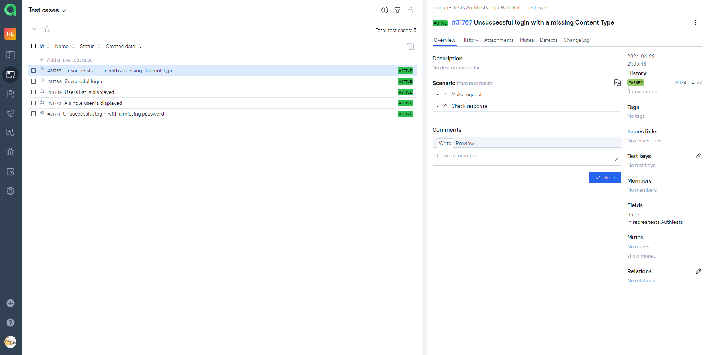

# Test API automation project for [REQRES](https://reqres.in/)


## About REQRES
Reqres.in is a resource that provides a public API that you can use to build and test your applications.

## Contents
- <a href="#technologies">Tools and technologies</a>
- <a href="#testcases">Executed automation test cases</a>
- <a href="#running">Running Autotests</a>
- <a href="#report">Allure Report</a>
- <a href="#testops">Allure TestOps integration</a>
- <a href="#jira">Jira integration</a>
- <a href="#telegram">Telegram notifications via bot</a>

<a id="technologies"></a>
## Tools and technologies
<p  align="center">

<code></code>
<code></code>
<code></code>
<code></code>
<code></code>
<code></code>
<code></code>
<code></code>
<code></code>
<code></code>
<code></code>
</p>


<a id="testcases"></a>
## Executed automation test cases
- Successful login
- Unsuccessful login with a missing Content Type
- Unsuccessful login with a missing password
- Users list is displayed
- A single user is displayed

<a id="running"></a>
## Running Autotests

### Local run
```
gradle clean test
```

### Jenkins run
```
clean test
```

<a id="report"></a>
##  Allure Report
 
 

<a id="testops"></a>
##  Allure TestOps integration
 
 

<a id="jira"></a>
##  Jira integration
 

<a id="telegram"></a>
## Telegram notifications via bot 
  
